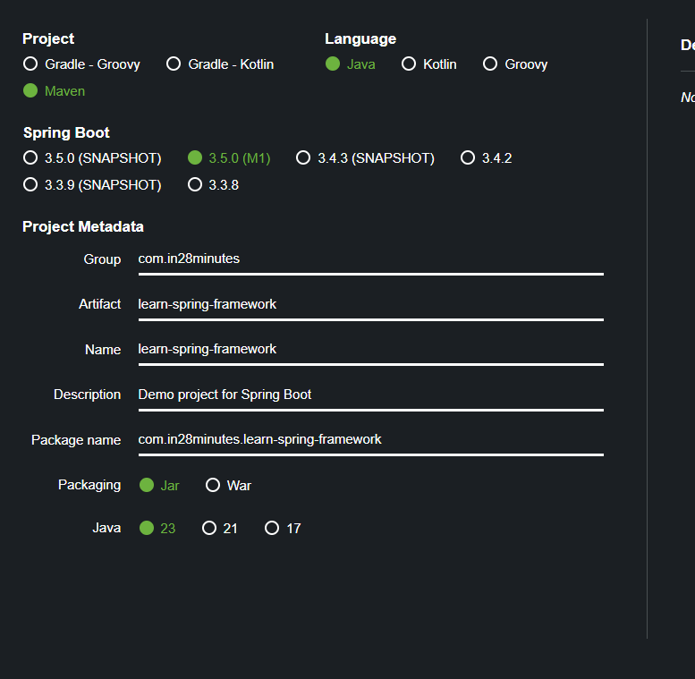
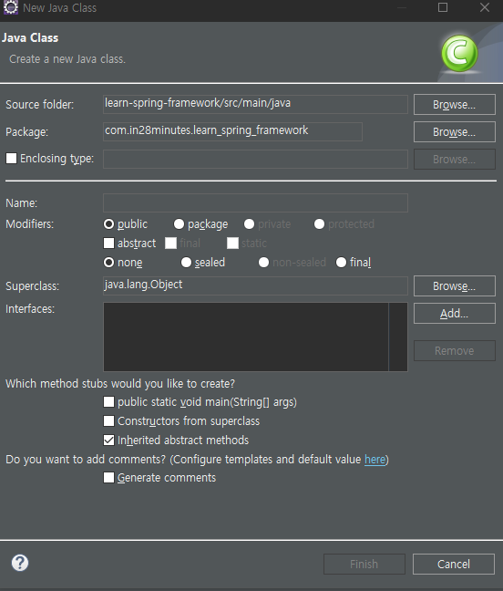
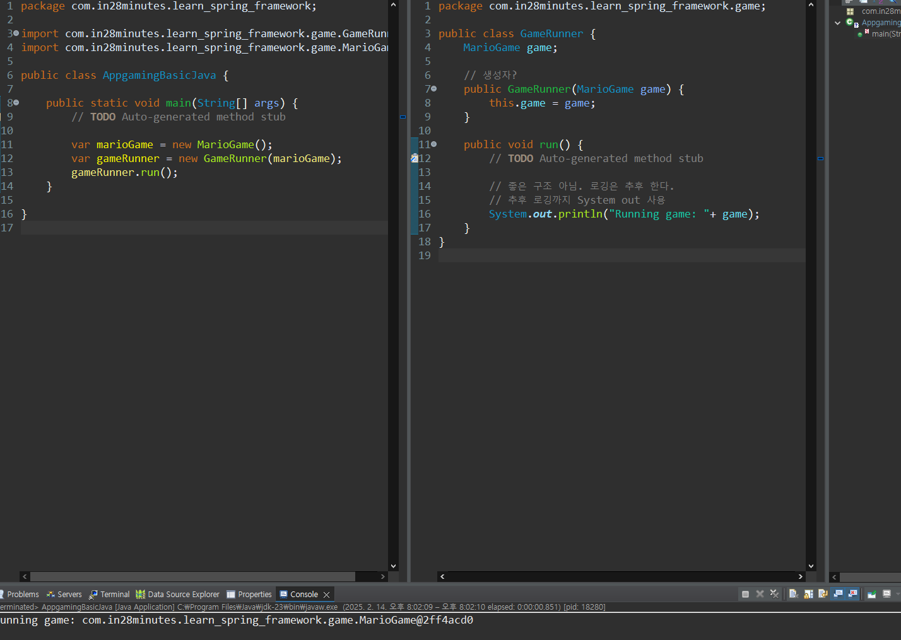

# 2025/02/14

## Spring을 배우자

- 그렇다.
- 의존성 주입 ㄱㄱ

Boot까지 배우면 더 편하다.

생산성 슉 슈슉임

---

우선 `Spring` 프레임워크가 필요한 이유와 용어를 배우자

> 용어가 상당히 추상적임
>
> 따라서 천천히 시작해보자!

## 시작하기

Spring 부터 하는 이유 -> Boot도 빠르게 익힐 수 있음

## 목표

1. 핵심 기능 이해
2. 실습 접근
3. "느슨하게 결합된" Hello World 외 구현
4. 다양한 용어에 대한 의해
   1. 강한 결합
   2. 느슨한 결합
   3. IOC 컨테이너
   4. 애플리케이션 컨텍스트
   5. 컴포넌트 스캔
   6. 의존성 주입
   7. 자동 연결

> 반복하면서 진행할 것.
>
> 1회차 = 강한 결함
>
> 2회차 = 느슨한 결합
>
> 3회차 = Spring 프레임워크 도입 (느슨한 결합 1단계)
>
> 4회차 = 느슨한 결합 2단계 with `Annotation`

자~ 드가자!

## 구축하기

> Maven & Java

`strat.spring.io`

걱정말고 최신버전을 쓰되 `SNAPSHOT` 쓰지 마쇼

그룹ID -`com.in28minutes`

아티팩트ID - `learn-spring-framework`

zip 파일이 다운로드 됨.

이후 `Eclipse`에서 import

불러오는 중. 오래걸림.

## IMPORT 후 1회차!

자바가 뭔지도 모르는데 Class 나 만들고 있다.

`Type name must not be qualified`?

패키지?

`public static void main`

## 대충 막 써봄

허거덩~

Eclipse -> `sysout` 하면 바로 `System.out.println()` 뽑아줌 <- 아니 안되는데?

" 진짜 클래스 기반으로 뭐 하라는 거 같다."

  > 매우 강한 결합임. MarioGame 은 걍 game 그자체니까. 